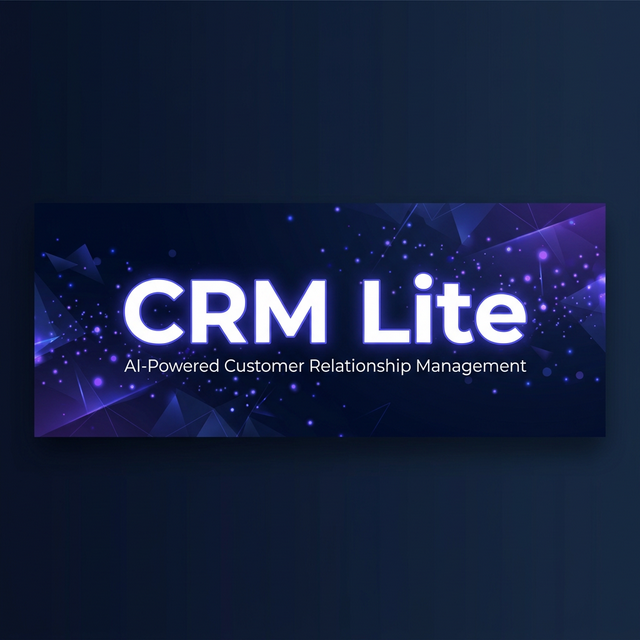
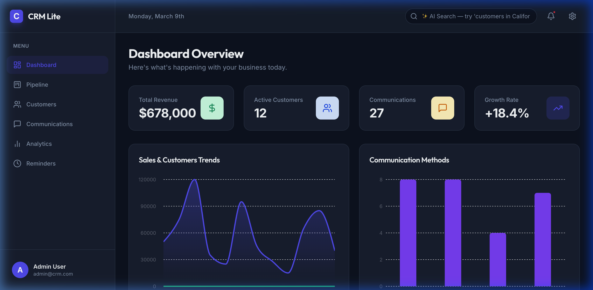
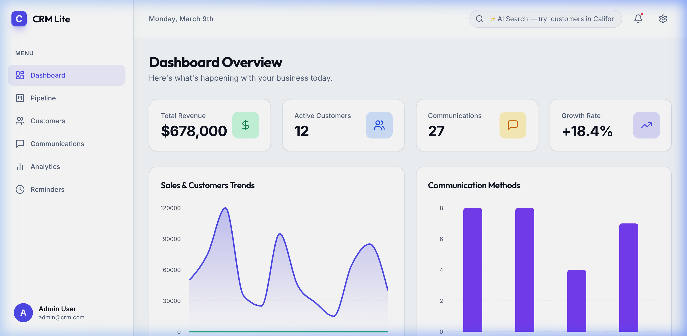
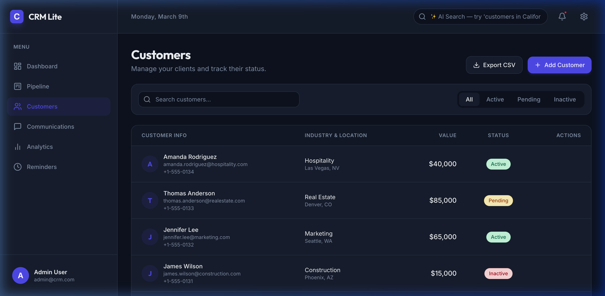
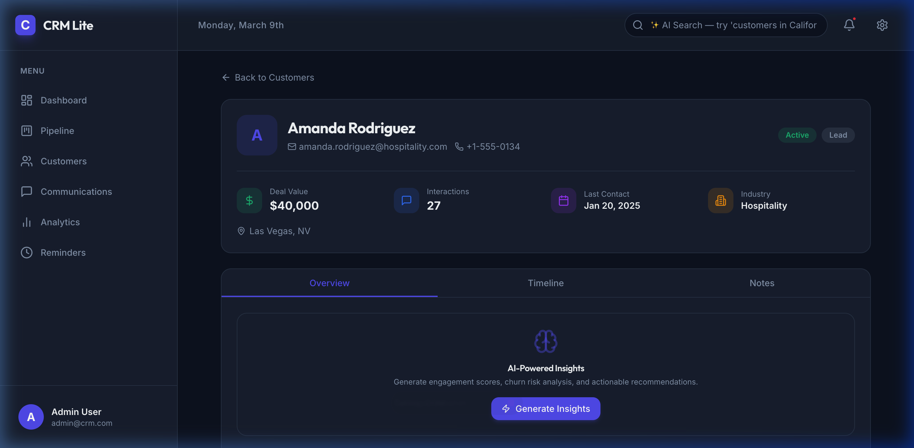
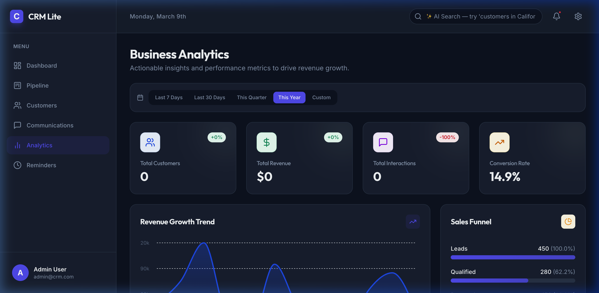
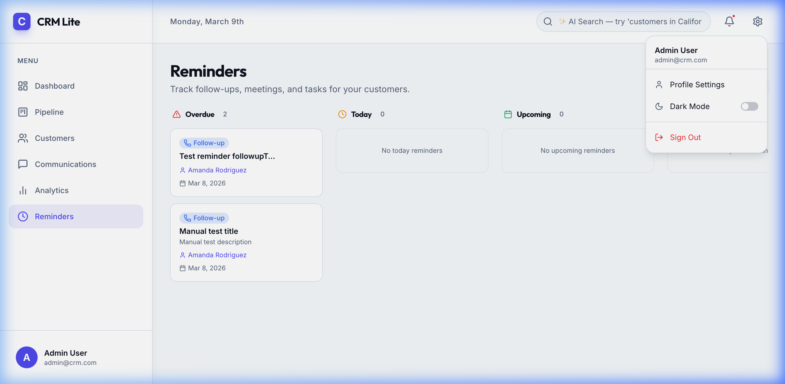

<p align="center">
  
</p>

<h1 align="center">CRM Lite — AI-Powered Customer Relationship Management</h1>

<p align="center">
  A full-stack SaaS CRM built with the MERN stack and Google Gemini AI, deployed on self-managed AWS infrastructure.<br/>
  Manage customers, track deals, analyze revenue, and leverage artificial intelligence — all from one dashboard.
</p>

<p align="center">
  
  
  
  
  
  
</p>

<p align="center">
  <a href="http://15.252.164.53/">
    
  </a>
  
</p>

<h3 align="center">🔗 <a href="http://15.252.164.53/">Try it live →</a></h3>

<p align="center">
  <strong>Demo credentials</strong> — no signup required<br/>
  <code>admin@crm.com</code> / <code>password123</code> &nbsp;·&nbsp; <code>sales@crm.com</code> / <code>password123</code><br/>
  <sub>Both are also one click away on the login page. The demo holds sample data only and re-seeds nightly, so explore freely — you can't break anything permanent.</sub>
</p>

<p align="center">
  <sub>⚠️ Served over HTTP, not HTTPS — your browser will show "Not Secure". Don't reuse a real password here.</sub>
</p>

---

## 📖 Table of Contents

- [About the Project](#-about-the-project)
- [Live Screenshots](#-live-screenshots)
- [Feature Deep-Dive](#-feature-deep-dive)
- [Architecture & Tech Stack](#-architecture--tech-stack)
- [Getting Started](#-getting-started)
- [Login Credentials](#-login-credentials)
- [How to Use the Application](#-how-to-use-the-application)
- [API Reference](#-api-reference)
- [Project Structure](#-project-structure)
- [Deployment](#-deployment)
- [Design Decisions](#-design-decisions)
- [Limitations](#-limitations)
- [Future Roadmap](#-future-roadmap)
- [Contributing](#-contributing)
- [License](#-license)

---

## 🎯 About the Project

**CRM Lite** is a comprehensive Customer Relationship Management platform designed to help sales teams manage their entire customer lifecycle — from initial lead capture to deal closure and ongoing relationship management.

Unlike basic CRUD applications, CRM Lite integrates **Google's Gemini AI** directly into the workflow, enabling sales professionals to:

- **Understand customer health at a glance** through AI-generated engagement scores and churn risk assessments
- **Search customers using everyday language** ("show me high-value tech companies in California") instead of rigid filters
- **Never miss a follow-up** with automated reminder creation after every customer interaction
- **Make data-driven decisions** with real-time analytics, date-range comparisons, and revenue trend visualization

The application is built as a monorepo with a decoupled REST API backend and a React single-page application frontend, following industry-standard patterns for authentication, state management, error handling, and responsive design.

### Key Highlights

| Metric | Detail |
|--------|--------|
| **Pages** | 8 fully functional pages (Dashboard, Customers, Customer Detail, Pipeline, Communications, Analytics, Reminders, Login) |
| **API Endpoints** | 22 route handlers across 6 route modules |
| **AI Features** | 2 Gemini-powered features (Customer Insights, Natural Language Search) |
| **Authentication** | JWT auth with bcrypt-hashed passwords. Roles are stored but **not enforced** — see [Limitations](#-limitations) |
| **Deployment** | AWS EC2 + nginx + pm2, MongoDB Atlas — see [Deployment](#-deployment) |
| **Data Models** | 4 MongoDB collections (Users, Customers, Communications, Reminders) |
| **Theme Support** | Full dark/light mode with CSS custom properties |
| **Responsiveness** | Mobile-first design with collapsible sidebar navigation |

---

## 📸 Live Screenshots

### Dashboard — Dark Mode
The main command center showing KPI cards (Total Customers, Revenue, Active Deals, Growth Rate), an interactive revenue trend area chart, communication type distribution, and a paginated table of recently added customers.

<p align="center">
  
</p>

### Dashboard — Light Mode
The same dashboard in light mode, demonstrating full theme compatibility. Every text element, background, border, and chart adapts seamlessly.

<p align="center">
  
</p>

### Customer Management
A paginated data table with real-time search, status filters (All / Active / Pending / Inactive), bulk CSV export, and inline actions. Customer names are clickable, linking directly to their detailed profile page.

<p align="center">
  
</p>

### Customer Detail — Full Profile with AI Insights
Each customer has a dedicated detail page featuring a profile header (avatar, contact info, status badges), quick-stat cards (Deal Value, Interactions, Last Contact, Industry), and three tabbed sections:
- **Overview** — AI-Powered Insights widget that generates engagement scores and churn risk
- **Timeline** — Chronological activity history of all communications
- **Notes** — Add and review customer-specific notes

<p align="center">
  
</p>

### Business Analytics with Date Range Filters
Advanced analytics dashboard with a date range filter bar offering five presets (Last 7 Days, Last 30 Days, This Quarter, This Year, Custom). KPI cards dynamically update to show the filtered values with comparison delta badges (±XX%) against the previous equivalent period. Includes a revenue growth area chart and a sales funnel visualization.

<p align="center">
  
</p>

### Smart Reminders — Kanban Board
A four-column Kanban-style board organizing reminders into Overdue, Today, Upcoming, and Completed categories. Reminders are auto-created when communications are logged, and past-due items are automatically flagged as overdue. Full CRUD operations (create, complete, reopen, delete) are available.

<p align="center">
  
</p>

---

## 🔍 Feature Deep-Dive

### 1. Interactive Dashboard
The dashboard serves as the central hub, providing an at-a-glance view of the business. It displays four KPI cards with animated counters, a Recharts-powered area chart for monthly revenue trends, communication type breakdowns, and a quick-access table of the five most recently added customers. All customer names are clickable, navigating directly to their full profile.

### 2. Customer Management (Full CRUD)
The Customers page provides a complete data management interface. Users can:
- **Add new customers** via a modal form with fields for name, email, phone, industry, location, deal value, and status
- **Search in real-time** — the search bar filters by name or email as you type
- **Filter by status** — segmented control buttons for All, Active, Pending, and Inactive
- **Edit customer details** — click the eye icon to open a detail modal where you can update the customer's status
- **Delete customers** — with a confirmation dialog to prevent accidental deletions
- **Export to CSV** — generates a `.csv` file of all (or filtered) customers for use in spreadsheets
- **Paginated results** — automatic pagination with Previous/Next controls and result count display

### 3. Customer Detail Page (Full Profile View)
Clicking any customer name navigates to a dedicated `/customers/:id` route showing:
- **Profile Header** — Large avatar initial, full name, email, phone number, and status/stage badges
- **Quick Stats** — Four metric cards showing Deal Value, Total Interactions, Last Contact date, and Industry
- **Location Pin** — City and state display
- **Tabbed Interface:**
  - **Overview Tab** — Houses the AI-Powered Insights widget (see below)
  - **Timeline Tab** — Uses the `ActivityTimeline` component to display a chronological list of every email, phone call, video call, and meeting associated with this customer. Each entry shows the communication type icon, date, status badge, priority level, and expandable notes
  - **Notes Tab** — A simple note-taking interface where users can add timestamped notes about the customer (stored in localStorage for persistence)

### 4. AI-Powered Customer Insights (Google Gemini)
On each customer's Overview tab, a "Generate Insights" button triggers a backend call to the Google Gemini API. The AI analyzes the customer's profile data (industry, deal value, communication history, status) and returns:
- **Engagement Score** (1–10) — displayed as a color-coded progress gauge (green for high, amber for medium, red for low)
- **Churn Risk** — classified as Low, Medium, or High with a corresponding badge
- **Recommended Action** — a specific, actionable suggestion based on the customer's profile
- **Summary** — a brief narrative assessment of the customer relationship health
- **Next Best Step** — the single most impactful action the sales rep should take next

Users can click "Refresh Insights" to regenerate the analysis at any time. The insights pane handles loading states and error cases gracefully.

### 5. Natural Language Search (Google Gemini)
The header search bar, labeled *"✨ AI Search — try 'customers in California'"*, accepts natural language queries. When the user types 5+ characters, a debounced request is sent to the backend, which uses the Gemini API to translate the query into a MongoDB filter object. For example:
- *"high-value tech companies"* → filters by `industry: "Technology"` and sorts by `value: -1`
- *"inactive customers in New York"* → filters by `status: "Inactive"` and `location` containing "New York"

Results appear in a live dropdown below the search bar, showing each matching customer's avatar, name, location/industry, and deal value. Clicking a result navigates directly to their detail page. If the AI service is unavailable, the search gracefully falls back to a simple text-based name search.

### 6. Drag-and-Drop Pipeline (Kanban)
The Pipeline page presents deals as cards organized into six columns representing sales stages: **Lead → Qualified → Proposal → Negotiation → Closed Won → Closed Lost**. Users can drag cards between columns to update a deal's stage. Each card displays the customer name, deal value, and a status indicator.

### 7. Communications Log
The Communications page allows sales reps to log every interaction with a customer. The form captures:
- **Customer** (dropdown selection)
- **Type** (Email, Phone, Video Call, Meeting)
- **Status** (Completed, Scheduled, Pending)
- **Priority** (High, Medium, Low)
- **Notes** (free-text field)
- **Date**

A key automation feature: **every time a new communication is logged, the backend automatically creates a follow-up reminder set for 3 days in the future**, ensuring no conversation goes unfollowed.

### 8. Advanced Analytics with Date Range Filters
The Analytics page goes beyond basic summaries by offering:
- **Date Range Filter Bar** — Five preset buttons (Last 7 Days, Last 30 Days, This Quarter, This Year, Custom) that trigger filtered API calls
- **Custom Date Range** — When "Custom" is selected, two date-picker inputs and an "Apply" button appear
- **Comparison Deltas** — When a preset is selected, the backend automatically calculates the equivalent previous period and returns percentage change. KPI cards display `+12%` or `-5%` badges in green or red
- **Revenue Growth Trend Chart** — Interactive Recharts area chart showing monthly revenue over time
- **Sales Funnel** — Visual bar chart showing lead-to-close conversion rates
- **Communication Breakdown** — Distribution of interaction types and statuses
- **Top Customers** — Ranked by deal value with avatars and industry tags

### 9. Smart Reminders & Follow-Up Automation
The Reminders page is a 4-column Kanban board:
- **Overdue** (red) — Reminders whose due date has passed; automatically flagged by the backend
- **Today** (amber) — Reminders due today
- **Upcoming** (green) — Reminders due in the future
- **Completed** (gray) — Finished reminders

Each reminder card shows its type badge (Follow-up, Meeting, Task, Custom), title, description, linked customer (clickable), and due date. Actions include:
- **Complete** — Moves the reminder to the Completed column
- **Reopen** — Moves a completed reminder back to the appropriate active column
- **Delete** — Permanently removes the reminder

The "Add Reminder" button opens a modal form where users select a customer, enter a title and description, choose a due date and type, and create the reminder. Additionally, reminders are **auto-created** by the backend whenever a new communication is logged, ensuring systematic follow-up.

### 10. Dark / Light Mode
The entire application supports theme switching via a toggle in the Settings menu (gear icon). The implementation uses CSS custom properties (`--bg-background`, `--text-brand-dark`, `--border-border`, etc.) applied to a root `[data-theme]` attribute, ensuring that every element — from KPI cards to chart tooltips to modal overlays — adapts correctly. Theme preference is persisted in localStorage.

### 11. Authentication & Authorization
The application uses JWT-based authentication:
- **Register** — Create new accounts with name, email, password, and role
- **Login** — Email/password authentication that returns a JWT token
- **Protected Routes** — All API endpoints (except auth) require a valid JWT in the `Authorization` header
- **Auto-Login** — On page load, the app checks localStorage for an existing token and validates it against the `/api/auth/me` endpoint
- **Role Support** — Admin and User roles are stored on the User model, but **no authorization middleware enforces them**. Every authenticated user can perform every action. The schema is a foundation for RBAC, not an implementation of it.

**Security note:** JWT signing previously fell back to a hardcoded string when `JWT_SECRET` was unset. That fallback has been removed — the server now refuses to start without a secret of at least 32 characters. Generate one with `openssl rand -base64 48`.

---

## 🏗️ Architecture & Tech Stack

```
┌─────────────────────────────────────────────────────────┐
│                    FRONTEND (React 19)                  │
│  TypeScript · Tailwind CSS · Framer Motion · Recharts   │
│  React Router v7 · Axios · React Hot Toast · date-fns   │
├─────────────────────────────────────────────────────────┤
│                    REST API (Axios)                     │
├─────────────────────────────────────────────────────────┤
│                  BACKEND (Express 5)                    │
│  JWT Auth · Mongoose ODM · CORS · Express Validator     │
├─────────────────────────────────────────────────────────┤
│              EXTERNAL SERVICES                          │
│  MongoDB Atlas/Local · Google Gemini AI API             │
└─────────────────────────────────────────────────────────┘
```

| Component | Technology | Why |
|-----------|-----------|-----|
| **Frontend Framework** | React 19 + TypeScript | Type safety, component reusability, latest concurrent features |
| **Styling** | Tailwind CSS 3.4 | Utility-first CSS for rapid UI development with custom theme support |
| **Animations** | Framer Motion | Production-grade animations with layout transitions |
| **Charts** | Recharts | Declarative, composable chart components built on D3 |
| **Backend** | Express 5 (Node.js) | Minimal, fast, unopinionated web framework |
| **Database** | MongoDB + Mongoose 8 | Flexible document model with schema validation |
| **Authentication** | JWT + bcryptjs | Stateless auth with hashed passwords |
| **AI Integration** | Google Gemini (`@google/genai`) | State-of-the-art LLM for customer analysis and NL parsing |
| **HTTP Client** | Axios | Promise-based HTTP with interceptors for auth headers |
| **Icons** | Lucide React | Consistent, lightweight icon system |

---

## 🚀 Getting Started

### Prerequisites

Ensure you have the following installed on your machine:

- **Node.js** v18 or higher — [Download here](https://nodejs.org/)
- **MongoDB** — Either a local installation or a free [MongoDB Atlas](https://www.mongodb.com/atlas) cluster
- **Google Gemini API Key** — Free at [ai.google.dev](https://ai.google.dev/) (required for AI features; the app works without it, but AI features will show errors)

### Step 1: Clone the Repository

```bash
git clone https://github.com/YOUR_USERNAME/crm-lite.git
cd crm-lite
```

### Step 2: Configure the Backend

```bash
cd server
npm install
```

Copy the example env file and fill it in:

```bash
cp .env.example .env
```

```env
MONGO_URI=mongodb://localhost:27017/crm
JWT_SECRET=          # openssl rand -base64 48
PORT=5000
GEMINI_API_KEY=your_gemini_api_key_here
```

> **`JWT_SECRET` is mandatory and must be at least 32 characters.** The server validates this at boot and exits with a clear message rather than starting in an insecure state. Generate one with `openssl rand -base64 48` — don't invent one by hand.
>
> If using MongoDB Atlas, replace `MONGO_URI` with your connection string, remembering to include the database name before the `?` and to percent-encode any special characters in the password.

### Step 3: Seed the Database

This populates the database with 12 sample customers, 27 communications, and 2 user accounts so you can explore the app immediately:

```bash
node seedData.js
```

You should see output confirming that users, customers, and communications were created.

### Step 4: Start the Backend Server

```bash
npm run dev
```

The server will start on `http://localhost:5000`. You should see:
```
Server running on 0.0.0.0:5000 [development]
MongoDB connected successfully
```

> In production (`NODE_ENV=production`) the server binds to `127.0.0.1` instead, so it is reachable only through the nginx reverse proxy.

### Step 5: Configure and Start the Frontend

Open a **new terminal** and run:

```bash
cd crm-lite-frontend
npm install
npm start
```

The React development server will start on `http://localhost:3000`. Your browser should open automatically.

### Step 6: Log In

Navigate to `http://localhost:3000` and use the demo credentials below.

---

## 🔐 Login Credentials

After running the seed script (`node seedData.js`), the following accounts are pre-configured and ready to use:

| Role | Email | Password | Access Level |
|------|-------|----------|-------------|
| **Admin** | `admin@crm.com` | `password123` | Full access to all features |
| **Sales Rep** | `sales@crm.com` | `password123` | Standard sales team access |

> **💡 Quick Login:** The login page includes one-click demo credential buttons. Click "Admin" or "Sales Rep" to auto-fill the email and password fields, then click "Sign In".

---

## 📘 How to Use the Application

### Logging In
1. Open the app at `http://localhost:3000`
2. Enter your email and password, or click one of the demo credential buttons
3. Click **"Sign In"** — you'll be redirected to the Dashboard

### Navigating the App
The left sidebar provides navigation to all pages. On mobile screens, the sidebar collapses into a hamburger menu. The header contains:
- **AI Search Bar** — Type natural language queries to find customers
- **Notification Bell** — View recent notifications
- **Settings Gear** — Toggle dark/light mode and access account settings
- **Profile Avatar** — Shows the current logged-in user

### Managing Customers
1. Go to **Customers** in the sidebar
2. Click **"+ Add Customer"** to create a new customer via the modal form
3. Use the **search bar** to find customers by name or email
4. Click the **status filter buttons** (Active, Pending, Inactive) to narrow the list
5. Click **"Export CSV"** to download the current view as a spreadsheet
6. Click any **customer name** to view their full detail page
7. Use the **eye icon** on hover to open a quick-edit modal
8. Use the **trash icon** on hover to delete a customer (with confirmation)

### Viewing Customer Details & AI Insights
1. Click any customer name to open their profile at `/customers/:id`
2. On the **Overview** tab, click **"Generate Insights"** to get an AI analysis
3. Switch to the **Timeline** tab to see all past communications
4. Switch to the **Notes** tab to add or view personal notes about this customer

### Logging Communications
1. Go to **Communications** in the sidebar
2. Click **"+ Add Communication"** to log a new interaction
3. Select the customer, type, priority, status, date, and add notes
4. Click **"Save"** — the communication is logged AND a 3-day follow-up reminder is automatically created

### Using the Pipeline
1. Go to **Pipeline** in the sidebar
2. View deals organized by stage (Lead → Qualified → Proposal → Negotiation → Closed Won/Lost)
3. Drag and drop cards between columns to move deals through the pipeline

### Analyzing Performance
1. Go to **Analytics** in the sidebar
2. Use the **date range filter bar** to select a time period
3. Click **"Custom"** and enter specific dates if the presets don't fit
4. Watch the KPI cards update with the filtered values and comparison deltas
5. Scroll down to see the revenue trend chart, sales funnel, and customer breakdowns

### Managing Reminders
1. Go to **Reminders** in the sidebar
2. View your reminders organized across four columns: Overdue, Today, Upcoming, Completed
3. Click **"+ Add Reminder"** to create a new one — select a customer, add a title, choose a date
4. Hover over any reminder card to see action buttons (Complete, Reopen, Delete)
5. Note: Reminders are also auto-created whenever a new communication is logged

### Toggling Dark/Light Mode
1. Click the **gear icon** (⚙️) in the top-right header
2. Toggle the **"Dark Mode"** switch
3. The entire UI will update immediately. Your preference is saved for future sessions

---

## 🔌 API Reference

All endpoints (except `/api/auth/login` and `/api/auth/register`) require a valid JWT token in the `Authorization: Bearer <token>` header.

### Authentication

| Method | Endpoint | Body | Description |
|--------|----------|------|-------------|
| `POST` | `/api/auth/register` | `{ name, email, password }` | Create a new user account |
| `POST` | `/api/auth/login` | `{ email, password }` | Authenticate and receive a JWT token |
| `GET` | `/api/auth/me` | — | Get the current user's profile (requires auth) |

### Customers

| Method | Endpoint | Description |
|--------|----------|-------------|
| `GET` | `/api/customers` | Retrieve all customers (supports `?search=` query param) |
| `GET` | `/api/customers/:id` | Retrieve a single customer by ID |
| `POST` | `/api/customers` | Create a new customer |
| `PUT` | `/api/customers/:id` | Update an existing customer |
| `DELETE` | `/api/customers/:id` | Delete a customer |

### Communications

| Method | Endpoint | Description |
|--------|----------|-------------|
| `GET` | `/api/communications` | Retrieve all communications |
| `GET` | `/api/communications/customer/:customerId` | Get all communications for a specific customer |
| `POST` | `/api/communications` | Log a new communication (auto-creates a 3-day follow-up reminder) |

### Analytics

| Method | Endpoint | Query Params | Description |
|--------|----------|-------------|-------------|
| `GET` | `/api/analytics/summary` | — | Total customers, revenue, and status distribution |
| `GET` | `/api/analytics/monthly-revenue` | — | Monthly revenue aggregation |
| `GET` | `/api/analytics/communications` | — | Communication count, type, and status distribution |
| `GET` | `/api/analytics/filtered` | `startDate`, `endDate`, `compareStartDate`, `compareEndDate` | Date-range filtered analytics with comparison deltas |

### AI (Gemini-Powered)

| Method | Endpoint | Body | Description |
|--------|----------|------|-------------|
| `POST` | `/api/ai/customer-insights` | `{ customerId }` | Generate AI engagement score, churn risk, and recommendations |
| `POST` | `/api/ai/natural-search` | `{ query }` | Translate natural language into MongoDB filters and return matching customers |

### Reminders

| Method | Endpoint | Description |
|--------|----------|-------------|
| `GET` | `/api/reminders` | Retrieve all reminders (auto-marks overdue ones) |
| `GET` | `/api/reminders/upcoming` | Get reminders due in the next 7 days |
| `POST` | `/api/reminders` | Create a new reminder |
| `PUT` | `/api/reminders/:id` | Update a reminder (e.g., mark complete or reopen) |
| `DELETE` | `/api/reminders/:id` | Delete a reminder |

---

## 📁 Project Structure

```
crm-app/
│
├── server/                           # ── BACKEND ──────────────────────────
│   ├── config/
│   │   └── db.js                     # MongoDB connection with Mongoose
│   ├── controllers/
│   │   ├── authController.js         # Register, login, get current user
│   │   ├── customerController.js     # Customer CRUD operations
│   │   ├── communicationController.js # Log communications + auto-reminder
│   │   ├── analyticsController.js    # Summary, monthly, filtered analytics
│   │   ├── aiController.js           # Gemini AI — insights & NL search
│   │   └── reminderController.js     # Reminder CRUD + auto-overdue
│   ├── models/
│   │   ├── User.js                   # User schema (name, email, password, role)
│   │   ├── Customer.js               # Customer schema (name, email, value, stage, etc.)
│   │   ├── Communication.js          # Communication schema (type, notes, priority)
│   │   └── Reminder.js               # Reminder schema (title, dueDate, status, type)
│   ├── routes/
│   │   ├── auth.js                   # POST /register, /login, GET /me
│   │   ├── customerRoutes.js         # Full REST customer routes
│   │   ├── communicationRoutes.js    # Communications + by-customer route
│   │   ├── analyticsRoutes.js        # Summary, monthly, filtered routes
│   │   ├── aiRoutes.js               # AI insights + natural search
│   │   └── reminderRoutes.js         # Reminder CRUD + upcoming
│   ├── middleware/
│   │   ├── auth.js                   # JWT token verification (protect)
│   │   └── errorHandler.js           # Global error handling
│   ├── seedData.js                   # Database seeder (12 customers, 27 comms)
│   ├── server.js                     # Express app entry point
│   └── .env                          # Environment variables (not committed)
│
├── crm-lite-frontend/                # ── FRONTEND ─────────────────────────
│   └── src/
│       ├── components/
│       │   ├── ActivityTimeline.tsx   # Chronological communication display
│       │   ├── AddCommunicationForm.tsx # Communication logging form
│       │   ├── AddCustomerForm.tsx    # Customer creation form
│       │   ├── CustomerInsights.tsx   # AI insights display widget
│       │   ├── Modal.tsx             # Reusable modal overlay
│       │   └── ProtectedRoute.tsx    # Auth-guarded route wrapper
│       ├── pages/
│       │   ├── Dashboard/            # KPI cards, charts, recent customers
│       │   ├── Customers/            # Data table with search & filters
│       │   ├── CustomerDetail/       # Full profile + AI insights + timeline
│       │   ├── Pipeline/             # Drag-and-drop Kanban board
│       │   ├── Communications/       # Communication log & creation
│       │   ├── Analytics/            # Charts + date range filters
│       │   ├── Reminders/            # 4-column Kanban reminder board
│       │   └── Login/                # Authentication page
│       ├── layouts/
│       │   └── DashboardLayout.tsx   # Sidebar + header + NL search bar
│       ├── context/
│       │   ├── AuthContext.tsx        # JWT auth state management
│       │   └── ThemeContext.tsx       # Dark/light mode state
│       ├── config/
│       │   └── api.ts                # Centralized API endpoint constants
│       └── types/
│           └── index.ts              # TypeScript interfaces for all entities
│
├── assets/                           # README images and banner
└── README.md                         # This file
```

---

## ☁️ Deployment

The application runs on a single AWS EC2 instance with nginx as reverse proxy and static host, Node under pm2, and the database off-instance on MongoDB Atlas.

```
Browser ──HTTP──> EC2 t3.micro (ap-south-1)
                    │
                    ├── nginx :80 ──── React build (/var/www/crm)
                    │                  gzip · immutable /static/ · SPA fallback
                    │
                    └── nginx /api/ ──proxy──> Node :5000 (127.0.0.1 only)
                                                    │
                                                    └──TLS──> MongoDB Atlas M0
```

### Why this shape

| Decision | Reasoning |
|---|---|
| **Database off-instance** | A `t3.micro` has 1 GB RAM. Running `mongod` alongside Node leaves neither enough headroom. Atlas M0 is free and removes the problem. |
| **Node bound to `127.0.0.1`** | The API is unreachable except through nginx, even if a security-group rule is too permissive. Port 5000 is never opened. |
| **Frontend served same-origin** | The bundle calls a relative `/api` path that nginx proxies, so there is no cross-origin request and no CORS surface in the default setup. |
| **Frontend built locally, not on the server** | `react-scripts build` needs ~1.5 GB and OOM-kills a 1 GB instance even with swap. |
| **pm2 over a bare systemd unit** | Restart backoff, memory ceiling, log management and reboot persistence without writing any of it. |
| **Least-privilege DB user** | The application user has `readWrite` on one database only — no `atlasAdmin`, no `readWriteAnyDatabase`. |

### Deploying it yourself

```bash
# 1. Provision a fresh Ubuntu 24.04 instance (installs Node 20, nginx, pm2, ufw, 2 GB swap)
scp -i key.pem deploy/setup-server.sh deploy/nginx.conf ubuntu@YOUR_IP:~/
ssh -i key.pem ubuntu@YOUR_IP 'bash setup-server.sh'

# 2. Create /var/www/crm-api/.env on the server (see server/.env.example)

# 3. Build, ship, install, restart, health-check — one command
./deploy/push.sh ubuntu@YOUR_IP key.pem
```

Full instructions, free-tier cost mechanics, and a troubleshooting guide written from the failures actually encountered are in **[DEPLOY.md](DEPLOY.md)**.

### Bugs this deployment surfaced

Deploying exposed six defects that were invisible in local development, all worth reading if you're deploying a Node app for the first time:

1. **JWT signing fell back to a hardcoded secret** (`process.env.JWT_SECRET || 'secretkey'`) — an authentication bypass if the variable were ever unset. Removed; startup validation added.
2. **Every error stack trace was silently swallowed** — the error handler logged `err.stack.red`, relying on a `colors` package that was never a dependency.
3. **The seed script hardcoded `mongodb://localhost:27017`** and never loaded `.env`, so it could only ever work against a local database.
4. **Frontend and backend disagreed on the port** (3001 vs 5000).
5. **The password pre-save hook re-hashed already-hashed passwords** when the password wasn't modified, silently locking users out on any profile save.
6. **CORS rejected same-origin POSTs** — browsers send an `Origin` header on all non-GET requests, so every browser login failed while `curl` succeeded.

---

## 💡 Design Decisions

| Decision | Rationale |
|----------|-----------|
| **CSS custom properties for theming** | Enables dark/light mode without class duplication; every component references theme-aware variables |
| **Client-side filtering on Customers** | With <1000 records, client-side filtering provides instant feedback without API round-trips |
| **Auto-reminder on communication creation** | Ensures systematic follow-up; sales reps don't need to remember to create reminders manually |
| **Gemini API with JSON response format** | Structured AI outputs ensure reliable parsing; graceful fallback when AI is unavailable |
| **Debounced NL search (600ms)** | Prevents excessive API calls while typing; triggers only after the user pauses |
| **date-fns over Moment.js** | Tree-shakeable, modern date library with smaller bundle size |
| **Framer Motion for animations** | Declarative API for complex layout animations with minimal code |
| **Centralized API config** | All endpoint URLs in one file (`config/api.ts`) makes backend URL changes trivial |
| **Relative `/api` base URL by default** | The bundle isn't pinned to a hostname, so the same build works on any domain behind the nginx proxy |

---

## ⚠️ Limitations

Stated plainly, because a README that only lists strengths isn't much use to anyone evaluating the code.

**Not implemented:**

- **No tests.** The only test file is CRA's default `App.test.tsx`, which asserts against a "learn react" link this app doesn't render — it would fail if run. This is the project's biggest gap.
- **No HTTPS.** The live demo is served over HTTP, so credentials cross the network in plaintext and browsers flag the login form as insecure. Certbot is documented in [DEPLOY.md](DEPLOY.md); it needs a domain name, which the raw IP can't provide.
- **The demo runs on a bare IP**, so the link breaks if the instance is ever stopped and restarted with a new address.
- **No role-based access control.** Roles exist on the User model; no middleware enforces them.
- **No CI/CD.** Deployment is a shell script run manually.
- **No rate limiting** on auth endpoints, no refresh tokens, no token rotation.
- **No real-time updates**, no websockets, no email/SMS sending, no file attachments, no audit log.

**Known trade-offs:**

- **Customer filtering is client-side**, which is fast and simple under ~1,000 records but needs server-side pagination beyond that.
- **The Notes tab persists to `localStorage`, not the database** — notes are per-browser and won't survive a device change.
- **Demo credentials are displayed on the login page**, deliberately — this is a portfolio demo holding fabricated data, and a signup wall would only deter people from trying it. A nightly cron re-seeds the database so a visitor can't leave it empty. If this ever held real data, that block would need removing and the accounts reseeding with generated passwords.
- **`@tanstack/react-query` is installed but largely unused** — most data fetching is direct axios calls.

---

## 📄 License

This project is open source and available under the [MIT License](LICENSE).

---

<p align="center">
  <strong>Built with ❤️ using React, Node.js, MongoDB & Google Gemini AI</strong><br/>
  <sub>If you found this project useful, consider giving it a ⭐</sub>
</p>
